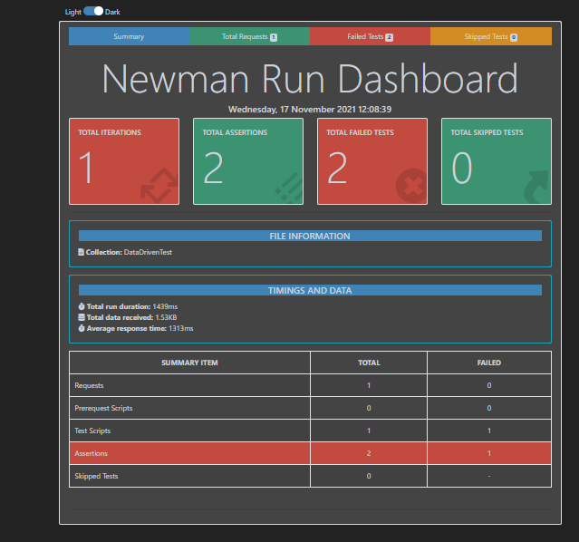
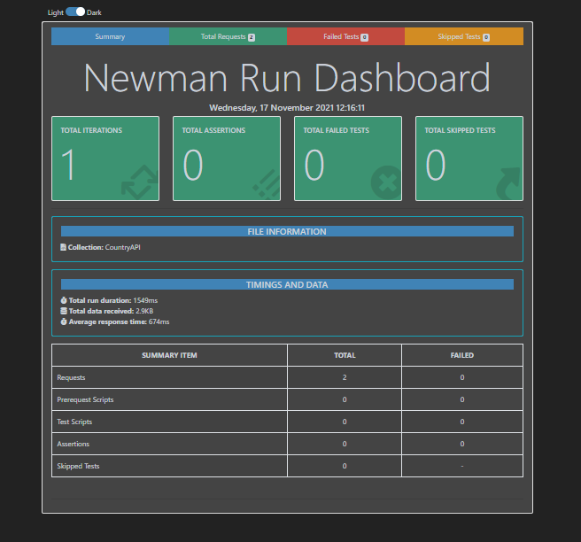
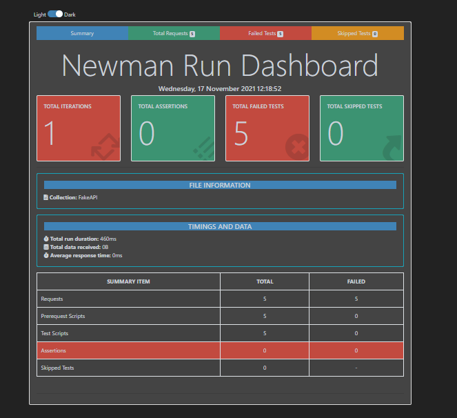
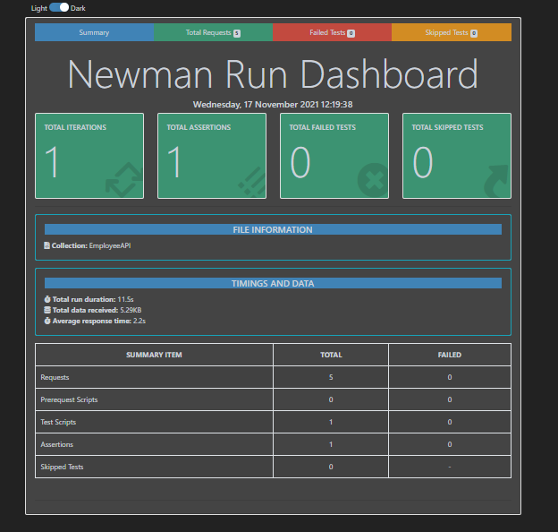

# API_Postman
## 1. Contents
### Pre-Requisites

-Install NodeJS and NPM

-Newman

-Postman Collection

-Assertions - Postman Test Scripts

-Postman Environments

-Configure app.js and package.json

-Command Line Execution of Collections

### Run the Postman Collection

-Run Multiple Postman Collections

-Run the Postman Collection with Environment

-Run the Collection with Environment and Generate Newman Report

-Run the Collection with Environment and Generate Custom Report

-Report Configuration

-Command Line Options

-Node Application Execution of Collections

-Run the Collection as Node app

### 
<h2>2. How to run this project</h2>

  
  <ul>
			<li>clone the project</li>
			<li>Open terminal inside the project folder</li>
  <li>Give following command</li>
  
  -npm run Authorization.postman_collection.json -r htmlextra
  
   ### 
<h2>3. Screenshots</h2>
  
  <h5>1)DataDriventest </h5>

 <h5>2)CountryAPI </h5>

 <h5>3)FakeAPI </h5>

 <h5>4)EmployeeAPI </h5>

			
		
